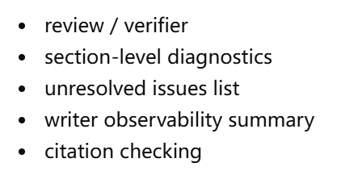

# agents 说明

## 多Agent整体说明
本项目涉及四个核心Agent，

- PlannerAgent
- ResearcherAgent
- DistillerAgent
- WriterAgent

## plannerAgent

## researcherAgent

面向图谱的研究员入口
研究员仅负责检索探索。它读取由规划器选定的任务，并返回原始的搜索 / 来源 / 片段材料，用于后续提炼。

researcher读取planner选中的active task，生成候选query、做relevance、admission、query去重、搜索、source过滤、passage收集，返回 ResearcherOutputs

### TODO:

- [ ] state.py 中兼容字段过多，会冗余存储
- [ ] query dedup 也先用本地 deterministic embedding fallback，后续可以替换成真实 embedding provider

## distillerAgent

轻量化预处理 → 结构化提取 → 结论-证据映射 → 冲突检测 → 文本压缩 → 分段证据包

- [ ] claim / fact 抽取目前是规则驱动，不是 LLM 抽取
- [ ] conflict detection 是启发式
- [ ] compression 是 token/Jaccard 去重，不是语义聚类
- [ ] evidence pack 选择是基于 section goal/title 的词项重叠
- [ ] 还没有真正接入 KnowledgeManager 主存持久化

## Writer

- 按 report_outline 逐 section 生成 Markdown
- 读取对应 section_goal
- 读取对应 section_evidence_pack
- 基于 claims / atomic facts / evidence 做规则化合成
- 对低覆盖和冲突情况做谨慎表述
- 保留轻量 traceability，例如 [claim_id] [evidence_id] [conflict_id]
- 自动补一个 Executive Summary
- 对低覆盖或冲突 section 生成 Open Questions / Research Gaps

### 待办

- [ ] 规则化合成 基于 claims(断言)、atomic facts(原子事实)、evidence(证据) 来编写 但文本自然度一般，章节之间的高层narrative可能偏机械 对复杂冲突的表达能力有限
- [ ] 后续把 writer 能力作为第一批升级点
- [ ] Open Questions/Research Gaps 由 Writer 生成，但 Writer 不应该由此生成新的调研任务建议或者研究计划
- [ ] Writer 只能基于这个把 "尚不确定"的内容给出
- [ ] 当前的FinalReport 复用的是旧 shema ，后面可能需要用专门的 WriterOutputs ，
- [ ] 当前在旧的 Schema 中包含了 markdown、section_ids、evidence_pack_ids、citation_map 字段 后续如果要更系统地支持  未来需要做 WriterOutputs和FinalReport 分层

